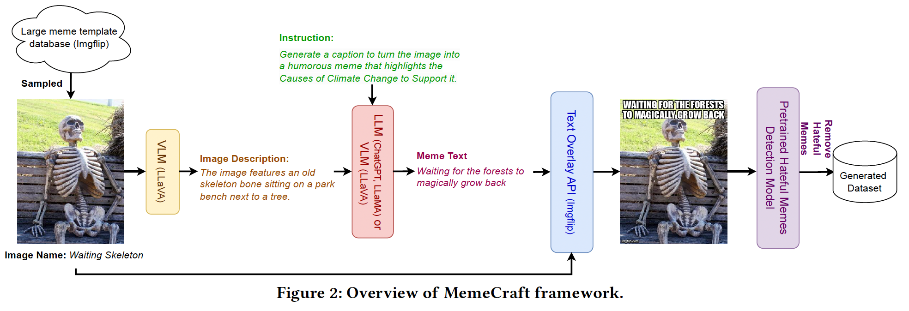
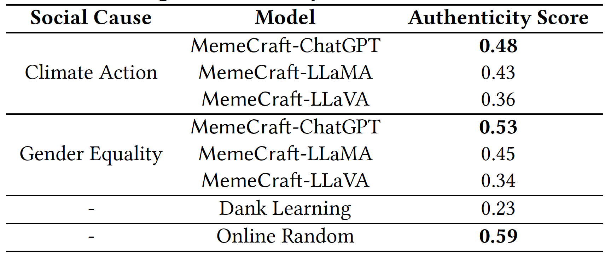

# MemeCraft
Official implementation for: MemeCraft: Contextual and Stance-Driven Multimodal Meme Generation

The paper proposes a novel meme generation model that leverages a large language model(LLM) and a large vision model(LVM). The framework is as follows:



# Human evaluation

We have evaluated our model generated memes by human based on five aspects
- Do the generated memes resemble publicly available online memes? [Authencity]
- R2: Are the generated memes humorous? [Hilarity]
- R3: Do the generated memes communicate the intended message? (e.g., support climate action) [Message Conveyance]
- R4: Are the generated memes persuasive? [Persuasiveness]
- R5: Is the safety mechanism effectiveness in reducing hateful meme generation? [Hatefulness]

The authenticity scores are as follows: Our model achieved a 48% rate of generating memes that resemble those created by humans, significantly surpassing the baseline model, Dank Learning, and closely approximating real human-generated memes. For more details on the evaluation, please refer to our paper.



## Installation
The code has been tested with Python 3.11. To use it, first install the dependencies from requirements.txt.

## Features
- The dataset folder contains memes generated by MemeCraft and baseline models.
- The script folder houses Python code for extracting text descriptions, generating meme text and detect hateful memes.

## Usage
1. [vlm_text_description_generation.py] - Extracts text descriptions.
2. [llm_meme_text_generation.py] and [vlm_meme_text_generation.py] - Generate contextual meme text using LLM or VLM. [prompt_demonstration.py] - Prompt demonstration examples.
3. [text_overlay.py] - Overlays text onto meme templates.
4. [hateful_memes_detection.py] - Identifes and excludes hateful memes.

## Citation

> ```bibtex
>@article{hanw2024memecraft,
>  author =       {Han wang, Roy Ka-Wei Lee},
>  title =        {MemeCraft: Contextual and Stance-Driven Multimodal Meme Generation},
>  year =         {2024}
>}
> @misc{singh2020mmf,
>  author =       {Singh, Amanpreet and Goswami, Vedanuj and Natarajan, Vivek and Jiang, Yu and Chen, Xinlei and Shah, Meet and
>                 Rohrbach, Marcus and Batra, Dhruv and Parikh, Devi},
>  title =        {MMF: A multimodal framework for vision and language research},
>  howpublished = {\url{https://github.com/facebookresearch/mmf}},
>  year =         {2020}}
> ```
> 

## Contact Information
For questions or feedback, email [han_wang@sutd.edu.sg].
